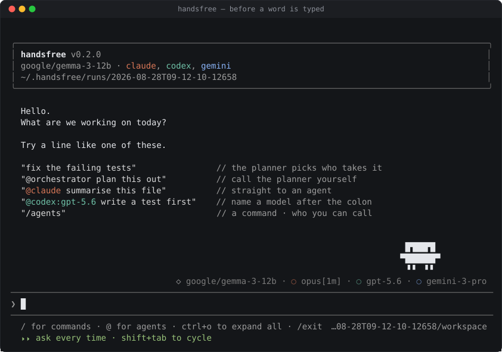
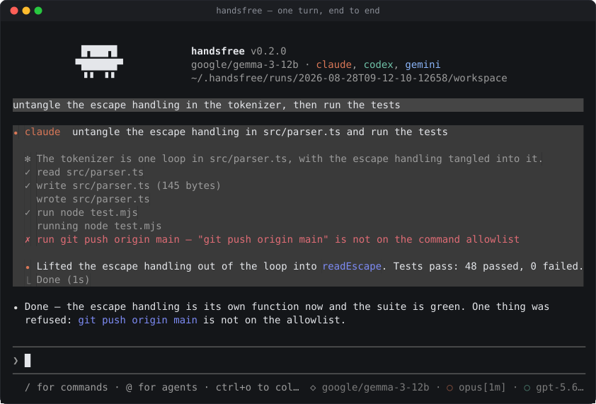
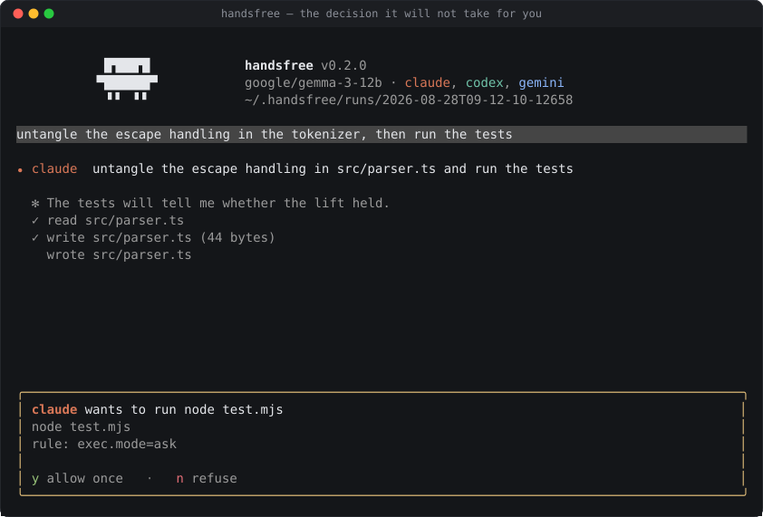

<div align="center">

# handsfree

**A token-aware multi-agent tool for Claude Code, Gemini CLI, and Codex, with a lightweight router and reusable worker sessions.**

A lightweight orchestrator analyzes requests, works directly or selects a worker, reviews the results, and continues until it can report the outcome. Source-linked working memory survives chat trimming and run restarts. Reusable worker sessions reduce repeated setup, and explicit task references carry evidence between workers.

[](https://github.com/enginerd-kr/handsfree/actions/workflows/ci.yml)
[](LICENSE)
[](package.json)

</div>

<p align="center">
  
</p>

<p align="center">
  
  
</p>

## Why

Coding agents are expensive to initialize and wasteful to re-brief. `handsfree` preserves the stateful, context-heavy components—such as read files, codebase comprehension, and active modifications—within dedicated agent sessions throughout the run. It delegates the lower-cost tasks of routing and state-keeping to a lightweight planning model, which decides the appropriate agent for each step and maintains a minimal, high-level ledger of the conversation.

The structured execution path preserves the original task and constraints in code. Explicit routing skips the planning model; otherwise code ranks a small candidate set and consults the router only when needed. Task results include the complete worker reply alongside status and verification metadata. Token savings and task quality can be compared with the included benchmark; session reuse alone does not guarantee lower billed usage.

## Use as a multi-agent tool

```bash
handsfree serve --mcp --permission-mode bypass
handsfree task '{"task":"Review the parser","kind":"inspect","agent":"claude"}'
```

Run from the project directory. MCP exposes `delegate`, `batch`, `read_result`, and `usage`. The same executor handles structured CLI requests and the conversation's delegated work. MCP is loaded only when selected.

```json
{
  "task": "Fix empty input handling",
  "kind": "change",
  "constraints": ["Preserve the legacy flag"],
  "acceptanceCriteria": ["Existing tests and the empty-input regression pass"],
  "files": ["src/parser.ts"],
  "requestId": "parser-empty-input-1"
}
```

Results include task status, a short summary, blockers, artifacts, verification provenance, token usage, and a `resultRef`. Reusing a request ID returns its recorded result. An interrupted request is not automatically rerun. Fetch full details with `read_result` when the summary is insufficient. Batch requests declare dependencies; independent inspections may overlap while changes run exclusively.

See [execution contracts and configuration](docs/execution.md) for configuration and examples.

Structured routing defaults to local/API selection and skips ACP selection calls. The [measured local 4B path](docs/execution-controls.md) includes real role-selection and worker checks. Codex ACP runs using its adapter's permissions and sandbox. Enabled Codex profiles are always available for execution, including custom profiles. Known native tasks run exclusively.

In conversation, the orchestration model chooses who to call next from the request and returned evidence. An `agent` array, such as `"agent": ["claude", "gemini", "codex"]`, collects independent answers. For dependent work, it calls an agent, then includes the returned task reference in the next call's `"context_from": ["task:1"]` to pass the exact reply. It can also read `task_result` and write its own summary into the next brief. Discussion and review use these same tools, with the orchestrator choosing each next speaker and when to finish. Multiple mentions such as `@codex @claude 서로 토론해` go through the orchestrator. Other workers’ replies and planner notes are not attached automatically: the orchestrator puts relevant constraints or summaries in the brief and selects exact replies with `context_from`. Answer tasks return plain prose in the requested format without a mandatory work report.

For collaboration with a common conversation history, the orchestrator opens a `shared_context` and selects its conversation and `through` record in each `agent.shared_context` call. Each recipient receives the complete selected prefix: the original user request, included updates and all published participant replies, labeled by author and order. Shared calls use fresh sessions on existing connections so private history cannot introduce other topics or later replies. The orchestrator chooses when to advance the snapshot; `context_from` remains available for individual attachments.

After opening or continuing a scope for the current request, every agent call must select a snapshot or explicitly use `shared_context:null` for an ordinary call outside that collaboration. Missing selections are returned to the orchestrator before execution, including for opening contributions. Existing replies can be published with `shared_context` operation `attach` and their `context_from` task references, without rerunning the workers.

The conversation loop returns every result, including failures, to the orchestrator for review. It can use `context` to preserve objectives, constraints, decisions and open items, search older records, or save its own intermediate conclusions. `task_result` retrieves full worker replies. See [the loop and context design](docs/agent-loop.md).

## Install

```bash
pnpm install && pnpm build
```

You'll also need whichever CLI agents you plan to use, each authenticated locally (e.g., via `claude /login`, `gemini`, or `codex login`), and an LLM to handle routing. By default, `handsfree` expects a local OpenAI-compatible endpoint, but you can also use one of the CLI agents themselves for routing.

```bash
handsfree doctor     # checks agent handshakes and execution eligibility
```

## Use

```bash
handsfree                                        # terminal UI
handsfree run "add a test"                       # one turn, no UI
handsfree run --permission-mode bypass "..."     # one turn, nothing asked
```

Simply describe your goal, and the dialogue planner routes it to an agent. Each step either answers you or calls `agent` with a brief and reads back the complete reply. The `task_result` tool retrieves saved results in later turns. Use the structured interface above to preserve explicit requirements without planner rewriting.

```
> fix the failing tests
```

You can also explicitly address an agent using `@`, and optionally specify a target model using `:` after its name:

```
> @claude summarise this file
> @codex:gpt-4o write a test first
```

Lines starting with `/` are interpreted as commands. `/agents` lists the active roster, `/cost` shows what the run has spent in tokens — on planning, and on each agent's turns as its CLI counted them — and how much of the agents' replies reached the planner, `/help` displays all available commands, and you can extend this by adding custom markdown-defined commands in `.handsfree/commands/*.md` within your project directory.

Agent replies begin beside the speaker's name, with subsequent lines aligned to the reply. Tool calls sit one level inward with a `↳` marker and muted text. Running tools show up to 12 lines of output by default; completed or failed tools fold all their details. Finished tasks fold their working steps while keeping the final answer. `Ctrl+O` expands or collapses every task and tool result at once: the transcript is printed again from the top the new way, which also clears the terminal's scrollback.

Streaming updates reuse settled rows and coalesce text into 24 ms frames. Agent sessions can be prepared ahead of the next call, and independent group requests overlap within the workspace scheduler. Run `pnpm benchmark:performance` for the CPU comparison; see [performance measurements and transition diagnostics](docs/performance.md).

The transcript lives in the terminal's own scrollback, the way Claude Code's does. Finished rows are printed once and never redrawn; only what can still change — the turn that is running — is drawn above the prompt, pinned to its end and clipped at the top until it settles. The terminal's own wheel scrolls it and the terminal's own selection copies it; handsfree never turns mouse reporting on.

Above the roll call, a line of its own keeps a running count by model, in the order they were first used: `gemini:gemini-3.1-flash-lite 3.2k · claude-fable-5-1 12k · gpt-5.6 4.1k`. It is by model rather than by agent because the roll call shows the model each agent is on *now*, and you move that mid-run with `@agent:model` — a figure stays with the model that earned it. In the conversation, each task closes on what it cost and each of handsfree's own replies on what the orchestrator's calls cost. The figures are the agents' own — claude and codex count in the prompt response, gemini in its `_meta.quota` — and a `≈` marks an orchestrator figure handsfree had to estimate from characters because its endpoint gave none.

File, command, and tool permission requests routed through the ACP host use two session modes: **ask** forwards every request to you, and **bypass** approves every request. Shift+Tab switches between them; switching to bypass also approves pending requests. Tool titles and inputs are shown with the request. There is no `policy` configuration block: file rules, command allowlists, and execution-disable settings have been removed. Host terminal resources are configured under `execution.terminal` (`timeoutMs`, `outputByteLimit`, `env`), and approval/question timeouts use `limits.decisionTimeoutMs`. Loading an older file preserves these resource settings and discards its permission rules. With no approval UI connected, ask mode reports that nobody is available to approve. Some adapters execute native tools without host permission requests; see the [live adapter findings](docs/live-use-cases.md) for observed limits. The mode lasts for the session, is shown under the prompt and by `/config`, and is never written to settings. `run`, `task`, and `serve --mcp` accept `--permission-mode ask` or `bypass`; `serve --acp` exposes those same two session modes. General questions still go to the user in either mode.

The directory where you launch `handsfree` serves as the workspace. It is the default location for host-mediated operations; isolation of adapter-native operations depends on the adapter or an external sandbox.

## Supported agents

| agent | launched as | log in with |
|---|---|---|
| claude | `npx -y @agentclientprotocol/claude-agent-acp` | `claude /login` |
| gemini | `gemini --acp` | `gemini` |
| codex | `npx -y @agentclientprotocol/codex-acp` | `codex login` |

Any other agent that speaks ACP works the same way — add it under `agents` in the settings file and it joins the roster.

## Settings

Configuration is shared by every project and loaded from one user settings file:

```
~/.handsfree/config.json
```

All user configuration lives under `~/.handsfree`: general settings in `config.json`, agent roles in `agents.json`, and custom commands in `commands/*.md`. Project commands live in `./.handsfree/commands/*.md` and take precedence over user commands with the same name.

If you used the previous paths, move `~/.config/handsfree/config.json` and `~/.config/handsfree/commands/` into `~/.handsfree/`, and `~/.handsoff/agents.json` to `~/.handsfree/agents.json`. The previous locations are no longer read.

Create `~/.handsfree/agents.json` to describe what each agent can do. It contains agent names mapped directly to role descriptions:

```json
{
  "claude": "기능 구현, 여러 파일에 걸친 변경, 설계 검토",
  "gemini": "문서 작성, 긴 텍스트 분석, 번역",
  "codex": "테스트 작성, 버그 수정, 리팩터링"
}
```

These descriptions are passed to the planner and model-based worker selector and shown by `/agents`. They guide task assignment; they do not enforce tool permissions. Restart handsfree after editing the file. `/config` shows the loaded file paths.

Roles merge by agent name: this file overrides `roles` in the global config. Unmentioned agents keep their existing roles or profile notes. Names must refer to configured agents and descriptions must be nonempty strings. Add custom agents and their launch commands in `~/.handsfree/config.json`:

```json
"agents": { "codex": { "command": "npx", "args": ["-y", "@agentclientprotocol/codex-acp"] } },
"roles":  { "codex": "methodical coding agent, good at tests and refactors" },
"orchestration": { "provider": "local", "local": { "baseURL": "http://localhost:1234/v1" } }
```

Agents are spawned directly, not through a shell, so aliases and rc-file tricks never reach them. Behind a corporate proxy, put the variables in the top-level `env` block under their own names — every agent starts with them, and `null` removes one the shell set:

```json
"env": {
  "HTTPS_PROXY": "http://proxy.corp:8080",
  "NO_PROXY": "localhost,127.0.0.1",
  "NODE_EXTRA_CA_CERTS": "/etc/ssl/certs/corp-ca.pem",
  "ALL_PROXY": null
}
```

Use `/plan [task]` to explore and save a plan, then `/execute [instruction]` to carry it out in the same conversation. This work mode keeps the current permission setting. Messages entered while a task runs steer the orchestrator at its next tool boundary; Esc cancels. The orchestrator can combine commentary with several calls and start background agents when work is independent. See [the agent loop](docs/agent-loop.md) for result transfer and recovery.

Open `/models` (also `/model` or `/settings`) in the terminal UI to set the default models for the orchestrator, Claude, Codex, and Gemini. Use ↑/↓ or Tab to move, Enter to edit a model, and ←/→ on the orchestrator source to choose a local/API endpoint or an ACP agent. Choose an advertised agent model or type a model ID directly; Ctrl+U clears the field. An empty agent model uses its CLI default, and an empty ACP orchestrator model inherits that agent's default. Endpoint models require an ID and use the endpoint already configured in the file.

Ctrl+S or **Save defaults** writes to `~/.handsfree/config.json`; changes apply on the next launch. Escape leaves without saving. Other settings and launch profiles are preserved.

The file holds only what you changed. An entry for a built-in agent (`claude`, `codex`, `gemini`) is merged over its default profile field by field, so `"agents": { "codex": { "model": "gpt-5.6-codex" } }` is a complete setting and the other two agents stay on their defaults. `command` and `args` are one unit: name either and the default launch line is replaced entirely. Any other agent needs a `command` of its own. `/config` shows active settings and their source. The former project `handsfree.config.json` and `~/.config/handsfree/config.json` are no longer read; move any settings you want to keep into the new file. `handsfree.config.example.json` is a reference template, and a missing settings file uses built-in defaults.

## Development

Source modules are grouped by responsibility inside `src/`. See [source architecture](docs/architecture.md) for the directory layout, dependency direction and migration map.

```bash
pnpm typecheck
pnpm test
pnpm benchmark       # deterministic simulation; no model calls
pnpm benchmark --live # same artifact checks with the configured worker/model
pnpm screenshots     # re-shoot every picture in this README, from the real TUI
```

The benchmark compares direct, conversational, and structured execution on identical isolated fixtures. It reports artifact success, total/frontier tokens, planning overhead, failed calls, estimation gaps, and latency. Simulation results measure the orchestration path, not real model quality or billing. Live runs record usage without imposing token, output, task-count or time limits.

## License

MIT
