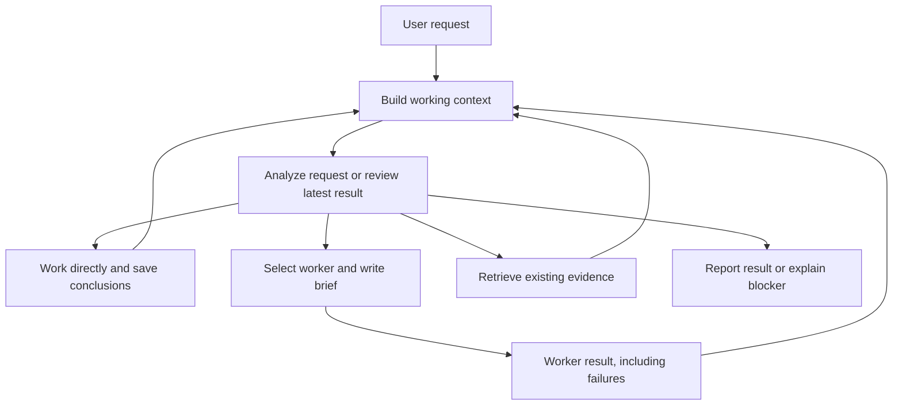

# Conversation loop and durable context

The orchestrator owns the user's request through its final report. It can do reasoning and conversational work itself, delegate a focused brief to a worker, retrieve evidence, or update its working memory. A worker finishing is an input to the next decision; it does not end the request automatically.



Each response carries `message`, `calls` and `finish`. Commentary can accompany several independently validated calls, or continue without calling a worker. `finish:true` requires a nonempty final message and an empty call list. Legacy `action:call` and `action:answer` objects remain readable. The model may include a `review` containing the objective, constraints, completed items, remaining items, an item index and a blocker as a progress note. The host records it as written, including source addresses. A review is optional and does not schedule calls or decide their completion. Worker success records the outcome of that invocation. The orchestrator decides what that evidence means for the user's objective and may call the same worker or revisit the same topic as needed.

`finish:true` ends the loop once outstanding background jobs have settled and their results have been delivered. The orchestrator decides when it can provide the requested result or explain a concrete obstacle. The host validates the action and tool arguments; it does not infer completion from progress-note wording, rewrite those notes, or suppress a call because the topic appeared in an earlier successful invocation. A protocol `end_turn` reports execution termination, not verification of the user's objective.

`agent` executes worker tasks or starts them in the background. `agent_job` lists, polls, waits for, cancels and follows up on those jobs. `plan` reads or saves the implementation plan. `context` supplies additional source-linked memory and lets the orchestrator record its own intermediate work. `task_result` reads saved worker output without rerunning a task. The orchestrator reviews evidence after each result and revises remaining work.

## Steering and optional plan mode

Ordinary input sent during a turn is recorded immediately and delivered as a `USER UPDATE` at the next model/tool boundary. The current tool settles; calls that have not started receive an explicit skipped result. The model then decides what to do with the original request, the returned evidence and the update. A final answer generated before the update is reconsidered. Esc cancels the active turn; it is separate from steering. Prompt-file commands wait for their own turn, while local commands remain available immediately.

`/plan [task]` selects planning in the same loop. The orchestrator can reason, inspect files, retrieve evidence and save a concrete Markdown plan with the `plan` tool. Change delegations are rejected in this mode. `/execute [instruction]` switches to execution and continues the saved plan, with any new instruction. Plans are stored in `<runDir>/plan.md` and versioned in the transcript. Work mode and plan content survive reopening the run, and `/clear` creates a fresh boundary.

Work mode is separate from permission mode: choosing plan or execute does not change `ask` or `bypass`. Already running worker prompts are not rewritten by a mode change. Planning guidance and task-kind checks are not a sandbox for adapter-native tools.

## Background agents

`agent` with `background:true` returns a `jobId` immediately. The orchestrator can start other work, inspect existing sources or wait through `agent_job`. Independent workers can overlap; the existing scheduler still serializes shared workspace changes and prompts to the same session. Completion notifications return full replies and their actual task IDs. `agent_job.wait` wakes when new user input arrives without cancelling its workers.

A follow-up targets a settled job's recipients with a new prompt and reuses available sessions. References to other workers remain explicit through `context_from`. A running job can be cancelled before following up. If the planner stops with an error or the user cancels the turn, outstanding jobs are cancelled and settled. Restart restores terminal results and marks unfinished jobs interrupted; it does not rerun them. Jobs from before `/clear` cannot re-enter the new conversation.

## Passing results between workers

`agent.context_from` selects full replies by task ID from this run. The host resolves all references before calling a worker and attaches the original replies with source agent, task ID and execution status. It preserves the full text, including failed or blocked results when the orchestrator wants help assessing them. The immediate `agent` tool result also includes the complete reply, so the final synthesis can assess the actual arguments without another retrieval call. The former `orchestration.relayAnswers` switch has been removed. Source results are data under the new brief's instructions. Missing references return an error to the orchestrator without calling a worker. Saved results remain available after restarting the same run.

For example, the orchestrator can call Claude, then ask Codex to review its exact reply:

```json
{"action":"call","tool":"agent","input":{"agent":"claude","kind":"answer","prompt":"Explain the proposed design."}}
```

After receiving task 1:

```json
{"action":"call","tool":"agent","input":{"agent":"codex","kind":"answer","prompt":"Evaluate Claude's argument and identify disagreements.","context_from":[1]}}
```

The next decision can forward Codex's result back to Claude, call another worker, or produce a synthesis. For an orchestrator-written summary instead, it reads `task_result`, writes its summary into the next `agent.prompt`, and can include source references as well. No discussion mode, fixed sequence, or round count is built into the host.

An agent array sends independent copies of a brief with the same selected source results; it does not pass newly produced replies or report summaries between recipients inside that call. Workers retain their own session history. Automatic cross-worker handoffs and decision injection have been removed. The orchestrator chooses all additional evidence through its prompt or `context_from`; file freshness notices remain host metadata. Multiple `@mentions` go to the orchestrator so it can decide the relationships between participants. A single leading `@agent` retains direct routing.

## Storage and retrieval

The task instruction is stored separately from its `contextFrom` source IDs. Referenced replies stay in their original result records and are assembled only when sending the worker prompt. Task listings and later result reads do not copy the attachments into the instruction.

The existing run directory is the persistence boundary:

| Data | Storage | Purpose |
| --- | --- | --- |
| Exact user requests, reviews, planning actions, notes and turn endings | `transcript.jsonl`, `context` records | Durable source of truth, replay and audit |
| Plans and work mode | `plan.md` and transcript `context` records | Resume planning or execution independently of permissions |
| Background job lifecycle and replies | Transcript `agent_job` records | Poll, follow up and recover interrupted jobs |
| Exact model-window checkpoints | Transcript `context.checkpoint` records | Recover older exchanges after a context overflow |
| Full worker outcomes | `results/<taskId>.json` | Paginated evidence retrieval |
| Active notes and searchable source addresses | In-memory `RunContext` index | Rebuilt from the run file on restart |
| Worker session IDs and file freshness | Existing session and memory records | Reuse relevant worker context |

Notes have a stable key, kind, text, source record IDs and an active flag. The kinds are `objective`, `constraint`, `decision`, `finding` and `open`. Reusing a key revises the active note; saving it with `active:false` resolves it. Earlier versions remain readable by record ID. Sources must exist in the current conversation. A note is the orchestrator's interpretation of those sources, not independent verification or an authorization grant.

The index processes only newly appended records. Task-ledger reconstruction is cached until task completion, resolution or clearing changes it. Searches use lexical relevance and recency; no database service or embedding model is required. This is an addressable graph of notes and source records, with a simple local search index. A database can replace the index later without changing the persisted evidence contract.

## Working context

During normal execution, every planning step receives:

1. Stable instructions and tool schemas.
2. All previous user/assistant turns in the current conversation.
3. The exact current request, latest optional review, and active objectives, constraints, decisions and open items.
4. Current worker sessions, task metadata, summaries from previous turns and result source addresses.
5. All tool calls and results from the current turn, plus any user updates.

Tool exchanges, including full worker replies, remain in the active turn. The run-state index omits summaries of those same replies to avoid repeating them. Retrieved evidence and saved findings are retained in full, and repeated identical reads share an entry. Worker prose and reports precede briefs in result retrieval. Active notes and the latest review are provided to the orchestrator; it carries relevant constraints, requested length and format into each worker prompt. Planner notes are not injected into workers automatically.

Restarting the same run reconstructs recent conversation and active notes. An unfinished turn is represented as interrupted, and its actions/results are available for inspection; workers are not automatically rerun. `/clear` creates a new context boundary. Old source IDs and late turn checkpoints cannot repopulate that context.

Answer tasks ask for the requested prose or format without a `REPORT` block. Inspection and change tasks retain structured outcome and verification reports, specified for the current task even after an answer in the same session. All task kinds return the full reply to the orchestrator.

## Model recovery

API and ACP adapters report normalized completion metadata. A truncated response is never executed, even if it contains parseable JSON. The loop requests one shorter replacement; repeated truncation is reported as a failure. Invalid response shapes get up to two repair requests. Authentication and refusal errors stop immediately, without calling the failing model again to narrate the error. These recovery rules do not impose limits on valid planning steps, delegations, spending or task duration.

On a context overflow, handsfree persists the exact active messages in a checkpoint and retries once with a smaller view. It retains user requests and updates, required notes and the plan, the latest worker replies and their call/result groups. Older exchanges stay readable by checkpoint record ID; full outcomes stay in their result files. `context.read` and `task_result` accept optional `maxChars` and return `nextOffset` for selected pages. If the required evidence still cannot fit, the loop reports the context failure rather than repeatedly sending the same overflowing request.

## Execution and cancellation

Planner and worker calls are metered without token, spending, character, step or delegation limits. There are no automatic request deadlines. Worker errors return to planning for recovery, evidence lookup or a blocker report. User cancellation ends the loop and closes an active worker connection. Direct `@agent` requests retain their direct routing and agent-owned reply.

The structured MCP/CLI executor also runs without numerical limits; workspace exclusion and one prompt at a time per worker session preserve execution ordering.

## Validation

Tests cover commentary with multiple calls, atomic call validation, mid-turn steering, stale final answers, persistent plan/execute transitions, background concurrency and session reuse, cancellation, job replay, typed API/ACP termination and context recovery with exact checkpoints. They also cover self-only answers, intermediate self work, failed-worker recovery, constraint propagation, repeated delegation and result reads, disk replay, complete source retrieval and revisions, interrupted turns, clear boundaries, full context/history retention, large batches and explicit cancellation. Result-context tests verify exact worker-to-worker transfer, orchestrator-written summaries, rebuttals, missing references, failed-result forwarding, independent opening statements, final rebuttal delivery, absence of implicit summaries or planner notes, separate instruction/reference storage, and reuse after restart. Scripted models test host guarantees; live local-model checks separately assess whether the model uses the loop well.

An explicit live planner smoke check uses deterministic worker replies and restarts the same run before asking about the original constraints:

```sh
pnpm exec tsx bench/agent-loop.ts --model=qwen3.5-9b-mlx
```

This does not contact real worker CLIs or change saved configuration. It writes a JSON evidence file with planner outputs, context records, prompt sizes and worker call counts. The checks cover execution count and constraint recall; the final prose still needs qualitative review.

In local checks on 2026-09-05, Qwen 3.5 9B completed the two-worker sequence, reported a synthesis and recalled Korean-response and `--legacy` constraints after restart without repeating worker calls. Gemma 3 4B remained unreliable on the multi-step scenario: it sometimes attempted renewed delegation during final synthesis or emitted invalid plans. The default configured model was not changed. These are smoke checks with fixture workers, not a broad model-quality evaluation or proof of real coding correctness.
