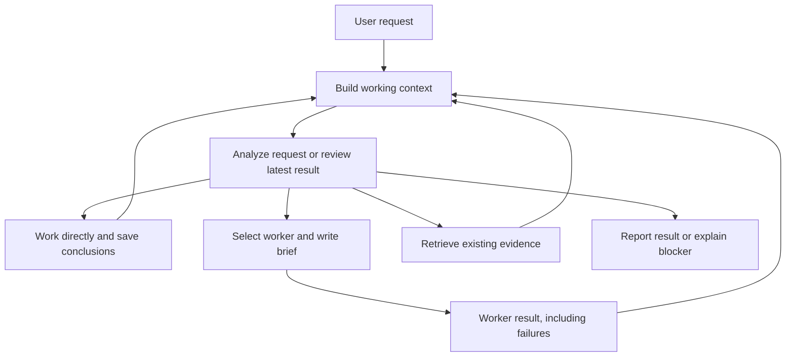

# Conversation loop and durable context

The orchestrator owns the user's request through its final report. It can do reasoning and conversational work itself, delegate a focused brief to a worker, retrieve evidence, or update its working memory. A worker finishing is an input to the next decision; it does not end the request automatically.



Every model-facing action schema requires a `review` containing the objective, constraints, completed items, remaining items, the selected `next` index and any blocker. Index 0 selects the first remaining item; -1 means no selected item. A worker call with -1 defaults to the first remaining item. The host checkpoints accepted reviews automatically, including their source addresses. Successful worker execution completes the selected item in the host's state; a stale model review cannot undo that execution or cause the same item to run again in that turn. Saving a finding can complete the orchestrator's own selected intermediate item. This records execution, not independent verification of a conclusion's correctness.

`answer` is the orchestrator's final response and may itself perform a selected synthesis or explanation. If its review still lists other work and no concrete blocker, the host rejects the premature ending and asks for a next action. The model still determines what the evidence establishes; a protocol `end_turn` is not proof of correctness. The parser also accepts legacy actions without a review for direct routing and older clients.

`agent` executes worker tasks. `context` supplies additional source-linked memory and lets the orchestrator record its own intermediate work. `task_result` reads saved worker output without rerunning a task. The orchestrator reviews evidence after each result and revises remaining work.

## Storage and retrieval

The existing run directory is the persistence boundary:

| Data | Storage | Purpose |
| --- | --- | --- |
| Exact user requests, reviews, planning actions, notes and turn endings | `transcript.jsonl`, `context` records | Durable source of truth, replay and audit |
| Full worker outcomes | `results/<taskId>.json` | Paginated evidence retrieval |
| Active notes and searchable source addresses | In-memory `RunContext` index | Rebuilt from the run file on restart |
| Worker session IDs and file freshness | Existing session and memory records | Reuse relevant worker context |

Notes have a stable key, kind, text, source record IDs and an active flag. The kinds are `objective`, `constraint`, `decision`, `finding` and `open`. Reusing a key revises the active note; saving it with `active:false` resolves it. Earlier versions remain readable by record ID. Sources must exist in the current conversation. A note is the orchestrator's interpretation of those sources, not independent verification or an authorization grant.

The index processes only newly appended records. Task-ledger reconstruction is cached until task completion, resolution or clearing changes it. Searches use lexical relevance and recency; no database service or embedding model is required. This is an addressable graph of notes and source records, with a simple local search index. A database can replace the index later without changing the persisted evidence contract.

## Working context

Every planning step receives:

1. Stable instructions and tool schemas.
2. All previous user/assistant turns in the current conversation.
3. The exact current request, latest review, and active objectives, constraints, decisions and open items.
4. Current worker sessions, complete task reports and result source addresses.
5. All tool calls and results from the current turn.

Tool exchanges remain in the active turn. Retrieved evidence and saved findings are retained in full, and repeated identical reads share an entry. Worker prose and reports precede briefs in result retrieval. Active notes and the latest review also accompany worker briefs, preserving saved constraints even when the model writes a short prompt.

Restarting the same run reconstructs recent conversation and active notes. An unfinished turn is represented as interrupted, and its actions/results are available for inspection; workers are not automatically rerun. `/clear` creates a new context boundary. Old source IDs and late turn checkpoints cannot repopulate that context.

## Execution and cancellation

Planner and worker calls are metered without token, spending, character, step or delegation limits. There are no automatic request deadlines. Worker errors return to planning for recovery, evidence lookup or a blocker report. User cancellation ends the loop and closes an active worker connection. Direct `@agent` requests retain their direct routing and agent-owned reply.

The structured MCP/CLI executor also runs without numerical limits; workspace exclusion and one prompt at a time per worker session preserve execution ordering.

## Validation

Tests cover self-only answers, intermediate self work, failed-worker recovery, constraint propagation, repeated delegation and result reads, disk replay, complete source retrieval and revisions, interrupted turns, clear boundaries, full context/history retention, large batches and explicit cancellation. Scripted models test host guarantees; live local-model checks separately assess whether the model uses the loop well.

An explicit live planner smoke check uses deterministic worker replies and restarts the same run before asking about the original constraints:

```sh
pnpm exec tsx bench/agent-loop.ts --model=qwen3.5-9b-mlx
```

This does not contact real worker CLIs or change saved configuration. It writes a JSON evidence file with planner outputs, context records, prompt sizes and worker call counts. The checks cover execution count and constraint recall; the final prose still needs qualitative review.

In local checks on 2026-09-05, Qwen 3.5 9B completed the two-worker sequence, reported a synthesis and recalled Korean-response and `--legacy` constraints after restart without repeating worker calls. Gemma 3 4B remained unreliable on the multi-step scenario: it sometimes attempted renewed delegation during final synthesis or emitted invalid plans. The default configured model was not changed. These are smoke checks with fixture workers, not a broad model-quality evaluation or proof of real coding correctness.
