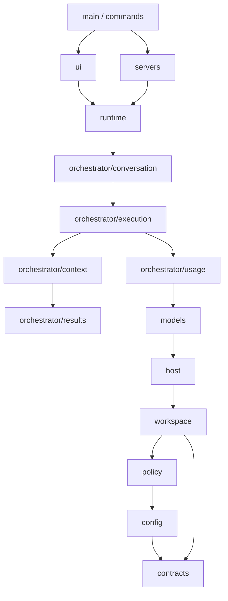

# Source architecture

The application is one package. Runtime code lives in `src/`, with relative ESM
imports and the existing `src/main.ts` CLI entry. Directories describe the work a
module owns; they do not introduce separate manifests or build steps.

```text
src/
├── main.ts                         CLI argument parsing and dispatch
├── runtime.ts                      Service construction and run lifecycle
├── debug.ts, version.ts            Diagnostics and application version
├── commands/                       CLI commands: run, task, doctor and TUI
├── servers/                        ACP/MCP adapters and shared elicitation forms
├── config/                         Schemas and ~/.handsfree/config.json loading/saving
├── contracts/                      Shared task, review, context and usage shapes
├── policy/                         Permissions, human input and path boundaries
├── workspace/                      Run directories, transcript and session storage
├── host/
│   ├── connection.ts, session.ts   ACP worker connections and sessions
│   ├── pool.ts, open.ts, launch.ts Worker reuse, connection retries and processes
│   ├── models.ts, mediation.ts     Model rosters and adapter capabilities
│   └── capabilities/              Host filesystem, terminal and input handlers
├── models/                         API/ACP chat clients and streamed JSON parsing
├── orchestrator/
│   ├── conversation/              Conversation loop, planning and narration
│   │   ├── commands/              Slash commands and prompt expansion
│   │   ├── tools/                 Model-facing agent, context and result tools
│   │   └── mention.ts             Agent/model mentions and completion
│   ├── execution/                 Delegation, routing, scheduling and task briefs
│   ├── context/                   Working context, task ledger and session memory
│   ├── results/                   Worker report parsing and outcome rendering
│   └── usage/                     Token metering and cost accounting
└── ui/                            Transcript view model and terminal UI
```

## Responsibility boundaries

`models` owns how to talk to a model and parse its streamed JSON. Planning prompts,
model-facing tools, reviews and narration belong to `orchestrator/conversation`,
because they decide what the application does with a model response.

`orchestrator/execution` owns the structured executor and worker delegation.
Conversation, CLI and protocol servers share this execution path. It uses the task
ledger and session memory in `context`, report interpretation in `results`, and
accounting in `usage`. The `conversation` directory also owns slash commands and
mentions, which the terminal UI uses for completion and interaction.

`host` owns outbound ACP connections to workers. Its capability handlers live
beside the connections that register and dispose them. `servers` owns the inbound
ACP and MCP interfaces through which editors and other clients drive handsfree.
CLI entry points remain in `commands`.

`contracts` contains the shapes exchanged across these areas. Transcript storage
uses its task status, context entry and usage types without importing the executor
or worker session implementations. Task status is derived from the task-result
schema. The reserved orchestrator name also lives here, so configuration validation
does not need the mention parser or completion code.

`runtime.ts` constructs and closes these services. UI, servers and CLI commands
consume that runtime; the execution and storage layers do not depend on them.

## Dependency direction

Arrows point from a consumer to a dependency. The diagram shows the main paths;
modules may also use lower layers directly.



`test/architecture.test.ts` checks source imports, including type-only references
and lazy imports. It rejects dependencies from lower areas to higher ones and
cycles between files. UI and server adapters remain independent. The check runs
with the normal test suite.

Unit tests stay beside their implementation. The root `test/` suite covers the
assembled runtime, protocol servers, UI and interactions between areas. The HTTP
model/routing test is `test/model-api.test.ts`; transcript/report integration is
`test/transcript-report.test.ts`.

## Migration map

| Previous location | Current location |
| --- | --- |
| `src/brain/client.ts`, `acp.ts`, `json.ts`, `planner.ts` | `src/models/` |
| `src/brain/plan.ts`, `narrate.ts` | `src/orchestrator/conversation/` |
| `src/capabilities/` | `src/host/capabilities/` |
| `src/commands/serve.ts`, `mcp.ts` | `src/servers/acp.ts`, `mcp.ts` |
| `src/orchestrator/conversation.ts` | `src/orchestrator/conversation/conversation.ts` |
| Executor, delegator, router, scheduler and briefs | `src/orchestrator/execution/` |
| Working context, ledger and session memory | `src/orchestrator/context/` |
| Reports and outcomes | `src/orchestrator/results/` |
| Budget/usage accounting | `src/orchestrator/usage/` |
| Request/result schemas and persisted review/context/usage types | `src/contracts/` |
| `src/tools/`, `src/slash/`, `src/mention/` | `src/orchestrator/conversation/tools/`, `commands/`, `mention.ts` |

The existing `pnpm typecheck`, `pnpm test`, `pnpm benchmark` and `pnpm build` commands
apply to the whole application. CLI behavior, dependency versions, configuration
formats and persisted run formats are preserved.
